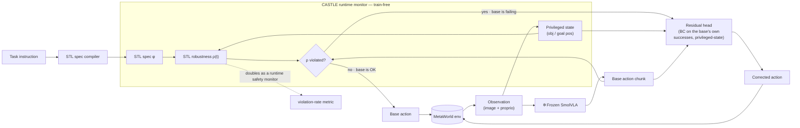
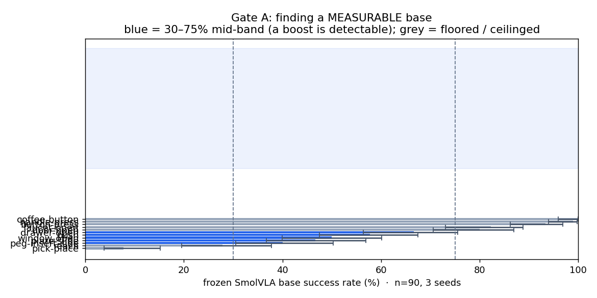
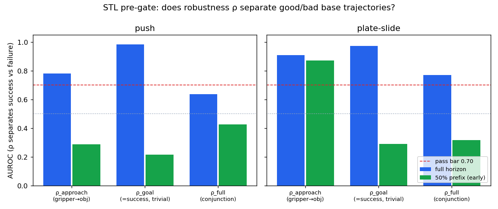
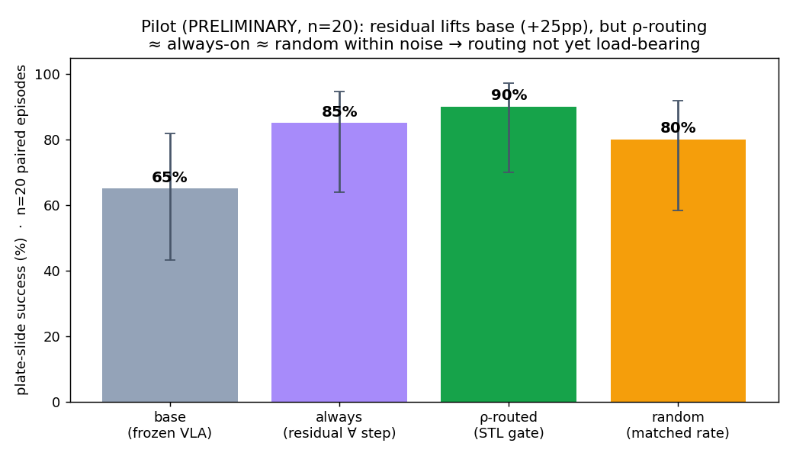

# CASTLE — Temporal-Logic-Routed Correction for Frozen Vision-Language-Action Policies

> **C**onstraint-**A**ware **S**hielding via **T**emporal **L**ogic for **E**mbodied policies
>
> A **training-free** Signal-Temporal-Logic (STL) monitor watches a **frozen** VLA as it acts, scores how well each rollout step satisfies the task spec (a robustness signal **ρ(t)**), and — *only where the policy is violating the spec* — routes a tiny learned **residual** that nudges the action back on track. The VLA's weights are never touched.

**Status (2026-05-30):** 🟡 **proposal-grade, method result preliminary.**
Novelty is **verified-unclaimed**; the verifier signal **works**; the headline correction lifts a frozen SmolVLA on plate-slide **65% → 90%** at n=20 — but whether the *temporal-logic routing* (vs. just applying the residual everywhere) is load-bearing is **not yet confirmed**. We report this honestly below and do not overclaim. See [RESEARCH_LOG.md](RESEARCH_LOG.md) for the full decision trail and [ROADMAP.md](ROADMAP.md) for what closes the gap.

---

## Architecture



**Figure 1 — Methodology.** The VLA stays frozen (❄️). An STL monitor compiles the task instruction into a spec φ and computes a per-step robustness ρ(t) from the privileged object/goal state. When ρ flags a violation (the base is failing the sub-goal), CASTLE applies a lightweight residual head — *behaviour-cloned from the base policy's **own** successful rollouts, and conditioned on the object/goal positions the VLA never sees* — otherwise the base acts unchanged. The same ρ doubles as a runtime safety signal (constraint-violation rate). Everything except the small residual head is training-free.

> The residual conditions on **privileged state the frozen VLA cannot observe** — this is the honest mechanism by which it can *add* capability, rather than merely re-rank the VLA's own samples (a pure shield can only do the latter, which we measured *underperforming* the base).

---

## The core insight: the base was the blocker, not the idea

Every prior "this method is dead on the undertrained checkpoint" verdict in this line of work (ILC, CASTLE-as-shield) was measured on **`reach-v3`**, where the frozen `smolvla_metaworld` checkpoint scores ~20–28%. A method that *corrects* a policy needs a base that is *near-competent* — on a floored base there is no headroom to recover.

We surveyed 12 MetaWorld tasks and found **`reach-v3` is a floored outlier**: the *same* frozen checkpoint sits in a clean, measurable **30–75% mid-band** on five other tasks.



**Figure 2 — Gate A: finding a measurable base.** Frozen-SmolVLA base success per task (n=90, 3 seeds, Wilson 95% CI). The blue band (30–75%) is where a correction method can actually be *measured* — too low and there's no headroom, too high and there's no room to improve. Five tasks land in-band (drawer-open 67%, push 58%, window-open 50%, plate-slide 47%, peg-insert 40%). `reach-v3` (28%) — the task every prior verdict used — is a floored outlier. **This is the finding that revived the project.**

---

## Does the STL signal actually work? (pre-gate)

Before training anything, we test CASTLE's never-run, **base-independent** kill-test: does the STL robustness ρ separate *successful* from *failed* base trajectories?



**Figure 3 — STL pre-gate (AUROC of ρ vs. eventual success).** `ρ_goal` (≈0.97–0.99) is near-tautological — it is essentially the success metric in disguise, so we discount it. The honest signal is `ρ_approach` (did the gripper engage the object): on **plate-slide it is strong _and early_ — AUROC 0.87 from only the first half of the episode**, meaning ρ can flag a doomed episode before it ends (the property a *router* needs). On push the early signal is weak (0.43) because push is non-prehensile — "approach the object" is the wrong sub-goal — which tells us **STL specs must match each task's structure.**

---

## Headline result (PRELIMINARY — n=20, plate-slide)



**Figure 4 — Pilot, plate-slide-v3, n=20 paired episodes (Wilson 95% CI).** Four conditions on identical env seeds: **base** (frozen VLA), **always** (residual every step), **ρ-routed** (residual only where STL flags a violation), **random** (residual at the same rate but random steps — the control that isolates *routing*).

| condition | success | what it tests |
|---|---|---|
| base | **65%** (13/20) | frozen SmolVLA, no correction |
| always-on residual | **85%** (17/20) | does the residual add capability at all? → **yes** |
| **ρ-routed (CASTLE)** | **90%** (18/20) | does STL-routing help? |
| random-routed | **80%** (16/20) | … beyond intervening at the same rate? |

**Honest read:** the residual gives a large raw lift (**base → ρ-routed = +25 pp**) — the capability-adding mechanism works. **But ρ-routed (90%) ≈ always-on (85%) ≈ random (80%) within n=20 noise, and the gate currently fires on 74% of steps (not selective).** So we **cannot yet claim the temporal-logic routing is load-bearing** — right now the method behaves close to "apply the residual everywhere," which would weaken it toward a plain residual-policy. Closing this is the top priority (selective gate + more seeds); see [ROADMAP.md](ROADMAP.md).

---

## Novelty (scoop check)

An adversarial literature audit returned **UNCLAIMED**: no prior work combines (STL-robustness routing) × (residual trained only on spec-violating segments) × (frozen VLA). Nearest neighbours:
- **SafeDec** — STL-shields a frozen foundation model but **trains no residual** (re-weights only).
- **A2C2 (2509.01728-class)** — trains a per-step correction head on frozen-VLA chunks but **uses no temporal-logic spec and corrects every step**.
- **VLA-SCT** — training-free within-trial statistical self-correction, **no temporal logic, no residual**.

> ⚠️ The scoop check was run by an external LLM; **verify each arXiv ID resolves before citing** (some IDs in such reports have been hallucinated in the past).

---

## Reproduce

```bash
# env: conda env with lerobot 0.4.4 + metaworld + SmolVLA; an A100-class GPU
export MUJOCO_GL=egl PYOPENGL_PLATFORM=egl
export PYTHONPATH=src

# 1. Gate A — find the measurable mid-band (n=90, 3 seeds, ~55 min)
python src/base_survey.py

# 2. Collect frozen-base rollouts WITH actions (training data; ~18 min)
python src/collect_rollouts.py --tasks push-v3,plate-slide-v3 --n_episodes 60

# 3. STL pre-gate — does ρ separate good/bad? (seconds, CPU)
python src/stl_pregate.py

# 4. Train the residual head on the base's successes (seconds)
python src/train_residual.py --task plate-slide-v3

# 5. Pilot — base vs always vs ρ-routed vs random (~25 min)
python src/pilot_eval.py --task plate-slide-v3 --n_eval 20

# regenerate the README figures
python docs/make_figures.py
```
> The frozen checkpoint (`smolvla_metaworld`, ~906 MB) and large rollout dumps are **not** committed — see `.gitignore`. Point the scripts at your local checkpoint via `--ckpt`.

## Repo layout
```
src/        STL verifier, residual head, training, eval, faithful-harness glue
results/    survey / pre-gate / pilot JSONs (the evidence behind the figures)
docs/       architecture (Mermaid above) + figure-generation script
RESEARCH_LOG.md   full decision trail: questions → findings → decisions → verdicts
ROADMAP.md        what to add next to move from proposal-grade to paper-grade
```

## References (verify IDs before citing)
- STL: Maler & Ničković, *Monitoring Temporal Properties of Continuous Signals*, 2004.
- Shielding: Alshiekh et al., *Safe RL via Shielding*, AAAI 2018.
- SmolVLA / OpenVLA / π₀ — the frozen VLA backbones.
